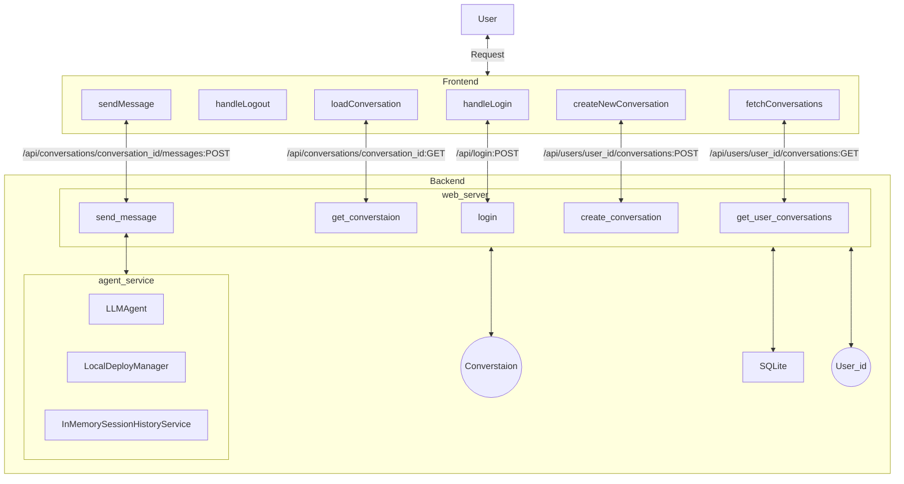

# Demo of a dialog system with conversation management

[](LICENSE)


This sample shows how to build a dialog system within the AgentScope Runtime framework.
It contains following features:
- User authentication
- Conversation management: user can start a new conversation or continue a previous one.
- Storage of conversations: on SQLite.
- agent deployment management: the agent is deployed as a service.


Click following image to watch the video demo:

<a href="https://cloud.video.taobao.com/vod/Tx-VhP3RxcO2ae51QCRuXzxKSw6OdbzLiNYgcUdMBZE.mp4" >

</a>

<br />


## 🌳 Project Structure

```bash
├── backend                           # Backend directory, contains server-side scripts and logic
│   ├── agent_server.py               # Script implementing agent-related server functionalities
│   └── web_server.py                 # Script acting as the web server, handling HTTP requests
├── frontend                          # Frontend directory, contains client-side code and resources
│   ├── public                        # Public folder, used for storing static files that are directly served
│   │   ├── index.html                # Entry HTML file for the frontend app
│   │   └── manifest.json             # Manifest file describing the web app's metadata, such as name and icons
│   ├── src                           # Source code folder, contains React components and associated files
│   │   ├── App.css                   # Stylesheet for the main app component
│   │   ├── App.jsx                   # JavaScript file for the main app component, written in JSX for React
│   │   ├── App.test.js               # Test file for the App component, used for unit testing
│   │   ├── index.css                 # Global stylesheet affecting the overall appearance of the application
│   │   ├── index.js                  # Entry point for the React application, renders content into `index.html`
│   │   ├── reportWebVitals.js        # Script for reporting web performance metrics
│   │   └── setupTests.js             # Configuration file for setting up tests, typically using a testing library
│   ├── package.json                  # Project dependencies file, lists all npm dependencies and scripts
│   ├── postcss.config.js             # Configuration file for PostCSS, used to process CSS with plugins
│   └── tailwind.config.js            # Configuration file for Tailwind CSS, customizing styles and themes
└── README.md                         # Project documentation file, provides basic information and usage instructions

```

## 📖 Overview

This demo demonstrates how to build a chatbot with conversation management using AgentScope Runtime. It includes features such as:

- Multi-user chat support
- Session management
- Real-time messaging
- Local deployment capabilities

The implementation separates concerns between agent logic (backend) and user interface (frontend) for better maintainability.


## ⚙️ Components

### Backend
- `agent_server.py`: Implements the chatbot agent logic and conversation management
- `web_server.py`: Provides web service endpoints for frontend communication

### Frontend
- React-based chat interface
- Tailwind CSS for styling
- Real-time message updates
- Multi-user session support

## 🌵Architecture

The architecture of the demo is depicted in the following diagram:


## 🚃 Dataflow

```mermaid
flowchart LR
    A[User Access Application] --> B{Is User Logged In?}
    B -->|No| C[Show Login Page]
    C --> D[Enter Username/Password]
    D --> E[Submit Login Request]
    E --> F[Backend Validates Credentials]
    F -->|Valid| G[Return User Data]
    G --> H[Fetch User Conversations]
    H --> I[Display Chat Interface]
    F -->|Invalid| J[Show Error Message]

    B -->|Yes| I

    I --> K{Select Conversation?}
    K -->|Create New| L[Create New Conversation]
    L --> M[Add Welcome Message]
    M --> N[Update Conversation List]

    K -->|Select Existing| O[Load Conversation]
    O --> P[Fetch Messages]
    P --> Q[Display Messages]

    Q --> R[Type Message]
    R --> S[Send Message]
    S --> T[Save User Message]
    T --> U[Update UI with User Message]
    U --> V[Call AI Service]
    V --> W[Process AI Response]
    W --> X[Save AI Response]
    X --> Y[Update UI with AI Response]

    I --> Z[Logout]
    Z --> A

    style A fill:#FFE4B5
    style B fill:#87CEEB
    style C fill:#DDA0DD
    style F fill:#98FB98
    style I fill:#FFA07A
    style S fill:#FFD700
    style V fill:#87CEFA
```

## 🚀 Getting Started
### Prerequisites
- Python 3.11+
- Node.js
- DashScope API key: you can apply for one at https://dashscope.console.aliyun.com/.

### Install
#### Prepare the database and env
Copy the database file `ai_assistant.db`.
```bash
cd backend
cp ai_assistant_example.db ai_assistant.db
```
You can modify the database file according to your needs.
It contains two initial accounts: user1 and user2.

Copy the `.env.template` to `.env`
```bash
cp .env.template .env
```
The `DASH_API_KEY` is the API key of DashScope.

#### Install the python packages
```bash
pip install -r requirements.txt
```

#### Install the npm packages
```bash
cd ..
cd frontend
npm install
cd ..
```
### Run
#### Run the agent server
Open a terminal and run the agent server.
```bash
cd  backend
python agent_server.py
```
It will listen on 8090.

#### Run the web server
Open another terminal and run the web server
```bash
python web_server.py
```
It will listen on 5100

#### Run the frontend
Open another terminal and run the frontend.
```bash
cd frontend
npm run start
```
It will listen on 3000. Open your browser and go to http://localhost:3000.

### Usage

1. Login in with initial account, e.g. user1 and password123.
2. (Optional) select a conversation or create a new one.
3. Type a message in the input box and click the "Send" button. e.g. what is your name.

## 🛠️ Features

- Local deployment capabilities
- Multi-user support
- Session management
- Real-time chat interface
- Tailwind CSS styling

## ℹ️ Getting Help

If you have any questions or encounter any problems with this demo, please report them through [GitHub issues]().

## 📄 License

This project is licensed under the Apache 2.0 License - see the [LICENSE](LICENSE) file for details.

## 🍬 Disclaimers

This is not an officially supported product. This project is intended for demonstration purposes only and is not suitable for production use.
