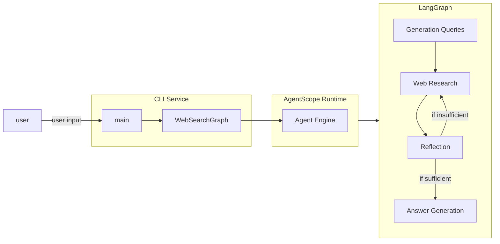

# DeepSearch Demo of Agentscope-Runtime with Langgraph / Qwen and Quark search
This project is modified from [Gemini Fullstack LangGraph Quickstart](https://github.com/google-gemini/gemini-fullstack-langgraph-quickstart).

It contains following key features:
1. We use LangGraph to build an agent (directed state graph) with the help of Qwen and Quark search.
2. The agent is wrapped as an Agentscope-Runtime agent and deployed as a service.
3. The interaction with the agent is done through a simple CLI.

Click following image to watch the video demo:

[](https://cloud.video.taobao.com/vod/-BhtPfhYZv8pCz7L1vYmKCDtf1QEaDXNX1hMnvj_BUQ.mp4)
<br />

## 🌳 Project Structure
```bash
├── src                               # Source code directory containing the core functionalities and modules
│   ├── init.py                       # Initialization script, possibly setting up environment or configurations
│   ├── configuration.py              # Module for handling application configurations and settings
│   ├── custom_search_tool.py         # Implements custom search functionality or tool
│   ├── graph_openai_compatible.py    # Module for OpenAI-compatible graph operations or integrations
│   ├── llm_prompts.py                # Contains large language model prompts used in the application
│   ├── llm_utils.py                  # Utility functions for handling large language model operations
│   ├── main.py                       # Main entry script to launch or execute the application
│   ├── state.py                      # Manages application state or data persistence
│   ├── tools_and_schemas.py          # Defines various tools and data schemas used by the application
│   └── utils.py                      # General utility functions used across the application
└── README.md                         # Project documentation file providing information and usage instructions
```

## Architecture
The architecture of the demo is shown in the following diagram:


## 📖 Overview

This demo demonstrates how to build a sophisticated research agent using:
- Qwen as the underlying language model
- LangGraph for defining complex agent workflows
- Custom search tools for information retrieval
- State management for multi-step reasoning

The implementation showcases advanced patterns for building agentic systems that can perform deep research tasks through iterative thinking and tool usage.

## ⚙️ Components

### Core Modules
- `configuration.py`: Configuration management for the agent
- `custom_search_tool.py`: Custom search functionality implementation
- `graph_openai_compatible.py`: LangGraph implementation with OpenAI compatibility
- `llm_prompts.py`: Prompt templates for different agent behaviors
- `llm_utils.py`: Utility functions for LLM interactions
- `main.py`: Main entry point for the application
- `state.py`: State management for the LangGraph workflow
- `tools_and_schemas.py`: Tool definitions and data schemas
- `utils.py`: General utility functions

## 🚀 Getting Started


## Install

Follow these steps to get the application running locally for development and testing.

**1. Prerequisites:**

-   Python 3.11+
-   Create a file named `.env` by copying the `.env.example` file.
-   **`DASHSCOPE_API_KEY`**:
  add  `DASHSCOPE_API_KEY="YOUR_ACTUAL_API_KEY"` if you use dashscope API.
- Quark Search API KEY: add `QUARK_AK=''` and `QUARK_SK=''` to `.env` file if you use quark search API.


**2. Install Dependencies:**

```bash
pip install -r requirements.txt
```

## Usage
Start the CLI Service.
```bash
cd src
python main.py
```
After that you can use the CLI to interact with the agent.

## 🛠️ Features

- `qwen` integration for advanced language understanding
- `langgraph` for complex workflow management
- Custom search tools for information retrieval
- Multi-step reasoning capabilities
- Stateful agent interactions
- Research-focused agent workflows

## ℹ️ Getting help

If you have any questions or if you found any problems with this demo, please report through [GitHub issues](https://github.com/your-org/demohouse/issues).

## 📄 License

This project is licensed under the Apache 2.0 License - see the [LICENSE](LICENSE) file for details.
